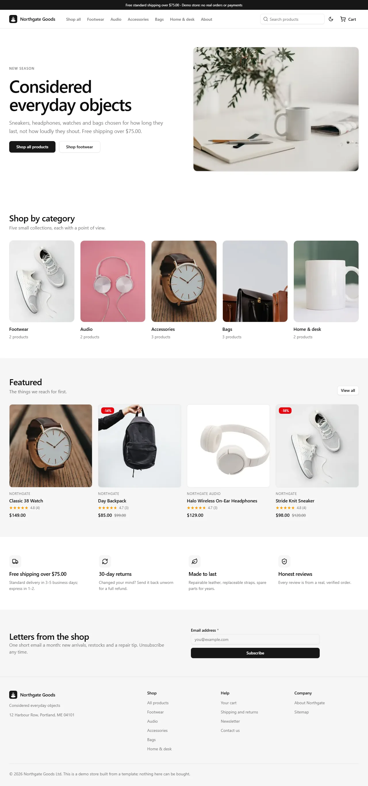

# Jaspr store template

A production-shaped **online store** built with [Jaspr](https://jaspr.site), the Dart
web framework that renders real HTML on the server. It uses the Cairn design
language (the same OKLCH tokens as `cairn_ui`) and is built to be found:
every page is server-rendered, works with JavaScript disabled, and hydrates
only three tiny islands.

> The shop ("Northgate Goods") is fictional. The checkout is a **demo**: it
> validates, reserves stock and records an order, and it **never takes, simulates
> or stores payment details**.

```
dart pub get
dart run build_runner build         # generates lib/main.*.options.dart
dart pub global activate jaspr_cli 0.23.4
jaspr serve                         # http://localhost:8080
```

Open `doc/index.html` for the full tutorial (rebranding, catalogue, SEO guide,
connecting a real backend and Stripe, deployment). This README is the reference.



## Contents

- [Why Jaspr here and not Flutter web](#why-jaspr-here-and-not-flutter-web)
- [What is in the box](#what-is-in-the-box)
- [Architecture](#architecture)
- [The request path](#the-request-path)
- [SEO checklist: what, and where](#seo-checklist-what-and-where)
- [URL and canonical rules](#url-and-canonical-rules)
- [The cart cookie](#the-cart-cookie)
- [Caching and security headers](#caching-and-security-headers)
- [Configuration](#configuration)
- [Run, build, deploy](#run-build-deploy)
- [Testing](#testing)
- [Gotchas learned](#gotchas-learned)
- [Known limitations](#known-limitations)

---

## Why Jaspr here and not Flutter web

The other templates in this repository are Flutter apps built from `cairn_ui`.
A store is the one kind of product where that is the wrong tool for the *web*
build, because most of a store's traffic arrives through search and link
previews.

| | Flutter web | Jaspr (this template) |
| --- | --- | --- |
| What a crawler receives | An empty shell plus a multi-megabyte bundle. Text is painted to a canvas (CanvasKit) or a semantics tree behind it. | Complete HTML: headings, prices, reviews, links, JSON-LD. |
| Link unfurlers (Slack, iMessage, LinkedIn, X) | Do not run JavaScript. They see one generic title and no product image. | Read per-route `og:` / `twitter:` tags straight from the first response. |
| Meta tags per route | Written by script after load (or not at all). | Rendered on the server per request from `SeoData`. |
| First paint | After the bundle downloads, compiles and boots. Typically seconds on a mid-range phone. | The first HTML byte is the content. The page has **zero** blocking JavaScript; the whole home page is 11.9 KB gzipped, including the inline stylesheet (6.7 KB gzipped). |
| JavaScript shipped | The whole framework. | 142 KB (47 KB gzipped) for three islands, `defer`red. Product pages are usable before it loads. |
| Works with JS off | No. | Yes: browse, search, filter, add to cart, promo, checkout. |
| Real URLs and status codes | Hash or client-routed; a 404 is a 200 that paints "not found". | Real `301`, `404`, `422`, `409`, `500`, `303` responses. |
| Accessibility | A parallel semantics tree to approximate the DOM. | The DOM. Labels, landmarks, `<details>`, native form controls. |
| Text selection, find-in-page, translate, reader mode | Limited. | Native. |

That is not a criticism of Flutter. It is why the *mobile* shop template stays
Flutter, and why this web storefront does not.

## What is in the box

Pages, all server-rendered with real URLs:

| Route | What it is |
| --- | --- |
| `/` | Hero (the LCP image, preloaded), category tiles, featured products, value props, newsletter form (plain POST). |
| `/products` | Listing with `?q=` search, `?sort=`, `?page=`; chips link to categories. |
| `/categories/:slug` | An indexable landing page per category. |
| `/products/:slug` | Gallery (`<picture>`, `srcset`, scroll-snap with anchor thumbnails), price, discount, rating, stock, variant radios, quantity, add to cart, `<details>` accordion, reviews, related products. |
| `/cart` | Server-rendered from the signed cart cookie; quantity, remove, promo (`CAIRN10` = 10%), totals, free-shipping progress. |
| `/checkout`, `/checkout/confirmation/:id` | Demo checkout with server-side validation and inline errors. |
| `/about`, `/newsletter` | Static content; newsletter POST flow. |
| `/sitemap.xml`, `/robots.txt`, `/manifest.webmanifest`, `/healthz` | Generated per request from the catalogue and `SITE_URL`. |
| 404 / 500 | Real status codes, `noindex`, helpful links. |

Client islands (the only JavaScript): `ThemeToggle`, `CartLink` (live count from
`GET /cart/summary`) and `AddToCartButton` (instant feedback through `fetch`,
falling back to the plain form post).

Catalogue: 12 products in 5 categories with variants, stock (including a
sold-out size and a low-stock watch), SKUs, valid GTIN-13s, brand, 31 reviews
and one renamed slug (`/products/classic-watch` 301s to `/products/classic-38-watch`).

## Architecture

Clean architecture with layers at the top of `lib/` and features inside them,
matching the other templates.

```
lib/
├── app.dart               StoreApp: routing, canonical redirects, Reply -> Response
├── main.server.dart       shelf pipeline + serveApp (entrypoint)
├── main.client.dart       hydrates the three islands
│
├── core/                  config (Brand, StoreConfig), Result, analytics, error reporting,
│                          seo/ (SeoData, RobotsPolicy, url_policy)
├── common/                constants, utils (money, slug, escape, text)
│
├── domain/                pure Dart, no framework
│   ├── catalog/           Product, Category, ProductQuery; QueryProducts, ResolveProductSlug, ...
│   ├── cart/              Cart, PricedCart; AddToCart, UpdateLineQuantity, ApplyPromo, PriceCart
│   ├── checkout/          CheckoutForm, Order; validateCheckout, PlaceOrder
│   ├── reviews/           Review, RatingSummary
│   └── newsletter/        SubscribeToNewsletter
│
├── data/<feature>/        repository implementations over the stand-in backend
│
├── presentation/
│   ├── theme/             Cairn tokens + global stylesheet (CSS authored in Dart)
│   ├── components/        button, forms, badge/alert/accordion/skeleton, breadcrumb,
│   │                      pagination, rating, price, product card, responsive images, icons
│   ├── shell/             skip link, announcement bar, header (no-JS mobile menu), footer
│   ├── seo/               seo_head.dart (SeoData -> <head>), structured_data.dart (JSON-LD)
│   ├── islands/           the three @client components
│   └── home/ catalog/ cart/ checkout/ pages/   page + controller per feature
│
├── http/                  RequestInfo, Reply, middleware, sitemap/robots/manifest
├── di/service_locator.dart  composition root (get_it) + StoreDeps
└── backend/               DEMO STAND-IN: seed catalogue, in-memory stores, cart cookie
                           (delete this directory when you connect a real backend)
```

Dependencies point inwards: `presentation -> domain <- data`. The seam to
replace is the set of repository interfaces in `lib/domain/*/`; see the docs for
a REST/Postgres/Firestore walkthrough.

**State** follows the reference template: no Riverpod or Bloc (their Flutter
bindings cannot exist here, and per-request SSR removes most of the problem).
Islands use `StatefulComponent` + `setState`; services use `get_it` with
constructor injection. Island rules: one `@client` per library, primitive props.

**Design system.** `presentation/theme/tokens.dart` holds the Cairn tokens as CSS
custom properties (neutral OKLCH palette, `--radius: 0.625rem` with the
sm/md/lg/xl multipliers, the 4 px spacing grid, the shadow ramp, 3 px focus rings
at 50% `--ring`). Components mirror Cairn's: `h-9 rounded-md` buttons, inputs with
`shadow-xs`, `rounded-xl` bordered cards, badges, alerts, accordions. Styles are
Dart (`@css` getters), collected by `jaspr_builder` into one inline stylesheet.
Tokens are typed constants (`Tok.border`); rules use a small `rule(selector, props)`
helper over Jaspr's `css()`. Light and dark use `prefers-color-scheme`, plus a
server-stamped `data-theme` from the `theme` cookie (or `?theme=`), so there is no
white flash.

## The request path

```
GET /products/stride-knit-sneaker?utm_source=x
  │
  ├─ shelf: logRequests → gzip → securityHeaders (CSP, HSTS, ...) → staticCaching
  ├─ serveApp: web/ static files first (images, island JS, icons) ...
  └─ StoreApp.handle
        ├─ RequestInfo.from        query, cookies, bounded form body (16 KB)
        ├─ method / same-origin checks      405 / 403
        ├─ path hygiene                     301 for // and trailing slash
        ├─ route -> CatalogController.product
        │     ResolveProductSlug → found | moved (301) | not found (404)
        │     GetReviews, GetRelatedProducts, categories
        │     builds SeoData: title, description, canonical (no utm_*), OG product tags,
        │                     BreadcrumbList + Product JSON-LD, LCP preload
        ├─ Reply (PageReply | RedirectReply | RawReply | NotFoundReply)
        └─ render: Document(head: buildHead(seo), body: SiteShell(ProductPage(...)))
              → Response 200, Cache-Control public, ETag, Vary: Cookie, Accept-Encoding
```

The render is a pure function of the controller's data, so tests assert on whole
pages with no sockets (`test/support/harness.dart`).

## SEO checklist: what, and where

| Requirement | Where | Proved by |
| --- | --- | --- |
| Unique, length-aware `<title>` and meta description | `documentTitle`, `description158` (`presentation/seo/seo_head.dart`, `common/utils/text.dart`); built per page in the controllers | `pages_seo_test.dart` (uniqueness across the sitemap), `http_units_test.dart` |
| Canonical (absolute, tracking params stripped) | `SeoData.path`, `url_policy.dart`, `listingUrl` | `pages_seo_test.dart`, `routing_test.dart` |
| `robots` meta + `X-Robots-Tag` | `RobotsPolicy`; search results `noindex, follow`, cart/checkout `noindex, nofollow` | `pages_seo_test.dart` |
| `lang`, viewport, `theme-color` (light/dark) | `app.dart`, `buildHead` | `pages_seo_test.dart` |
| Open Graph (`type/title/description/url/image/image:alt/site_name/locale`), `product:price:*` | `buildHead`, `CatalogController` | `pages_seo_test.dart` |
| Twitter card tags | `buildHead` | `pages_seo_test.dart` |
| hreflang hook | `SeoData.hreflangPaths` | `structured_data_test.dart` |
| JSON-LD: Organization, WebSite + SearchAction, BreadcrumbList, ItemList, Product + Offer + AggregateRating + Review | `presentation/seo/structured_data.dart` (output escaped by `safeJsonForScript`) | parsed as JSON in `pages_seo_test.dart`, `structured_data_test.dart`, `tool/seo_audit.dart` |
| Semantic HTML, one `<h1>`, heading order, skip link | `SiteShell`, pages | `seo_audit.dart` (every sitemap page) |
| Accessible forms: labels, `aria-invalid`, `aria-describedby`, `role=alert` errors | `components/forms.dart` | `flows_test.dart`, `components_test.dart` |
| Focus styles, `prefers-reduced-motion`, light/dark | `theme/global_styles.dart` | `pages_seo_test.dart` |
| Images: width/height, lazy except LCP, `fetchpriority=high` + preload, alt, `srcset`, `decoding=async` | `components/media.dart`, `SeoData.preloadImage` | `seo_audit.dart` (also checks files exist) |
| No webfont, one inline stylesheet, zero JS on content pages | system stack in `tokens.dart` | `pages_seo_test.dart` |
| HTTP caching: `public, max-age` + ETag + `Vary` for catalogue; `no-store` for cart/checkout; immutable hashed assets; gzip | `app.dart`, `http/middleware.dart`, `shelf_gzip` | `routing_test.dart`, `http_units_test.dart`, curl on the production build |
| Security headers (CSP, HSTS, referrer-policy, nosniff, frame-ancestors) | `http/middleware.dart` | `http_units_test.dart` |
| Redirect hygiene: trailing slash, `?page=1`, renamed slug 301, real 404 | `app.dart`, `catalog_controller.dart`, `listing_params.dart` | `routing_test.dart` |
| Dynamic `sitemap.xml` (+ image sitemap), `robots.txt`, manifest | `http/seo_endpoints.dart` | `http_units_test.dart`, `seo_audit.dart` |
| Crawl audit | `tool/seo_audit.dart` | `seo_audit_test.dart` (also proves the audit catches defects) |

Run the audit against a live server:

```
dart run tool/seo_audit.dart http://localhost:8080    # a running server
dart run tool/seo_audit.dart                          # in-process render (no server)
```

It crawls the sitemap and checks, for every page: status 200; exactly one title,
description, canonical (equal to the URL) and `<h1>`; heading order; `lang` and
viewport; absolute OG/Twitter URLs; valid JSON-LD with the fields rich results
need; every image has alt, width, height and a file on disk; every control is
labelled; no duplicate ids; no broken internal links or anchors. It also probes a
made-up URL (must be a real, `noindex` 404) and `robots.txt`.

## URL and canonical rules

- **Trailing slash:** removed with a 301 (`/products/` → `/products`). `//` collapses.
- **One spelling per state:** `?page=1`, `?sort=featured`, `?q=`, `?page=abc`, padded
  search text all 301 to the canonical spelling. `/search?q=x` → `/products?q=x`.
- **Categories:** `/products?category=audio` 301s to `/categories/audio`.
- **Tracking parameters** (`utm_*`, `gclid`, `fbclid`, ...) are never in canonical
  URLs. They are not redirected (that would lose the attribution).
- **Pagination:** page 2+ are *self-canonical*, indexable, and linked with
  `rel=prev/next`. Folding them into page 1 would hide products that are otherwise
  reachable only through pagination.
- **Sorting:** `?sort=price-asc` stays indexable but canonicalises to the unsorted URL.
  Consolidating signals this way avoids the contradictory `noindex` + canonical-to-other
  combination.
- **Search results:** `noindex, follow` (an unbounded space of thin near-duplicates),
  and disallowed in `robots.txt`. Trade-off: a disallowed URL cannot be crawled so
  Google will not see its `noindex`; the combination prevents crawling *and* indexing of
  almost everything, and the meta tag covers the case where one is linked.
- **Out-of-range page:** 404. **Unknown or malformed slug:** 404. **Renamed slug:** 301.

## The cart cookie

The cookie holds `<id>.<tag>`: a 128-bit server-issued id and a truncated
HMAC-SHA256 tag. The cart (ids and quantities, never prices) lives on the server,
keyed by the SHA-256 of the id. Prices are recomputed from the catalogue on every read.

- **Why server-keyed, not a client-held signed cart:** a client cart is capped at 4 KB, cannot
  be expired or inspected, grows every request, and invites storing prices that
  then have to be trusted.
- **Why sign an id the server already looks up:** forged ids are rejected without a store
  lookup, and rotating `CART_SECRET` invalidates every cart at once.
- **Flags:** `HttpOnly`, `SameSite=Lax`, `Path=/`, 14 days; over https also `Secure`
  and the `__Host-` prefix. A cookie is only issued on the first successful add
  (browsing never creates carts).
- **CSRF:** `SameSite=Lax` plus an `Origin`/`Sec-Fetch-Site` check on every POST.
- **Order ids** in `/checkout/confirmation/:id` are 96-bit random values; the page
  is `noindex` and `no-store`.

## Caching and security headers

| Response | `Cache-Control` | Notes |
| --- | --- | --- |
| Catalogue pages | `public, max-age=60, s-maxage=300, stale-while-revalidate=86400` | weak `ETag`, 304s, `Vary: Cookie, Accept-Encoding` |
| 404 | `public, max-age=60` | |
| Cart, checkout, newsletter, JSON, 500 | `no-store` | |
| Canonical 301 | `public, max-age=3600` | |
| `robots.txt`, `sitemap.xml` | `public, max-age=3600` | |
| `/images/**` | `public, max-age=604800, stale-while-revalidate=86400` | rename a file when it changes |
| Hashed files | `public, max-age=31536000, immutable` | |
| `*.js` | `public, max-age=0, must-revalidate` | |

Pages are identical for every visitor (the header cart count is an island, not
server HTML), so a CDN can cache them. They vary by the `theme` cookie; configure
your CDN's cache key to include **only** that cookie.

CSP: `default-src 'self'; script-src 'self'; style-src 'self' 'unsafe-inline'; ...
frame-ancestors 'none'; form-action 'self'`. `'unsafe-inline'` is for styles only
(the stylesheet is inlined). The nonce-based alternative is described in the docs.

## Configuration

Build-time, via `--dart-define` (public; compiled in): `APP_ENV` (`production`),
`SITE_URL`, `CURRENCY`, `ANALYTICS`.

Runtime, via the process environment: `PORT`, `SITE_URL` (overrides the compiled
value), `CART_SECRET` (32+ random characters; in production without it a random
per-process secret is used and carts reset on restart).

All brand copy lives in `lib/core/config/brand.dart`; policy (shipping,
promo codes) in `lib/core/config/store_config.dart`.

## Run, build, deploy

```
# develop
dart pub get
dart run build_runner build
jaspr serve                                        # hot reload, http://localhost:8080

# production build (AOT server + web assets)
jaspr build --dart-define=APP_ENV=production --dart-define=SITE_URL=https://shop.example
PORT=8080 CART_SECRET=... SITE_URL=https://shop.example ./build/jaspr/app
```

Static files are served from `web/` next to the executable (`build/jaspr/web`).

**Docker** (`Dockerfile`, multi-stage: `dart:3.12` builds, `debian:bookworm-slim`
runs as a non-root user):

```
docker build --build-arg SITE_URL=https://shop.example -t northgate-store .
docker run -p 8080:8080 -e SITE_URL=https://shop.example -e CART_SECRET=$(openssl rand -hex 32) northgate-store
```

**Cloud Run:**

```
gcloud run deploy northgate-store --source . --region europe-west1 --allow-unauthenticated \
  --set-env-vars SITE_URL=https://shop.example --set-secrets CART_SECRET=cart-secret:latest \
  --min-instances 1
```

**Fly.io:** `fly launch --no-deploy`, set `internal_port = 8080`, add an HTTP check on
`/healthz`, `fly secrets set CART_SECRET=...`, `fly deploy`.

Important: the demo backend keeps carts, orders and stock **in memory in one
process**. Run one instance (or `--min-instances 1 --max-instances 1`) until you
replace `lib/backend/` with a database. Cloud Run scales to zero by default, which
discards in-memory carts.

**Static export.** `jaspr build` with `jaspr: mode: static` can pre-render GET pages,
but a store needs a server for POSTs (cart, checkout, newsletter), the cart cookie,
`/cart/summary`, 304s and real status codes. A static export of the catalogue pages
is possible (the product pages are pure functions of the catalogue) but cart and
checkout will not work; this template is verified in server mode only.

## Testing

```
dart run build_runner build
dart analyze --fatal-infos
dart test
```

| Area | Files |
| --- | --- |
| Utilities, URL policy | `test/common/utils_test.dart` |
| Catalogue data integrity, search, filter, sort, pagination | `test/domain/catalog_test.dart` |
| Pricing, promo, shipping, cart rules, stock clamping | `test/domain/cart_test.dart` |
| Validation (email, per-country postal codes), place order, oversell, newsletter | `test/domain/checkout_test.dart` |
| Cart cookie signing/flags, stores, TTL, eviction | `test/backend/backend_test.dart` |
| Headers, caching, origin guard, listing params, sitemap/robots/manifest | `test/http/http_units_test.dart` |
| SEO tags and JSON-LD for every page; a11y basics | `test/server/pages_seo_test.dart` |
| Redirects, 404/405/500, caching, ETag/304 | `test/server/routing_test.dart` |
| No-JS flows: add, update, promo, checkout, confirmation, validation, CSRF | `test/server/flows_test.dart` |
| Whole-site audit + proof it catches defects | `test/server/seo_audit_test.dart` |
| Components and islands (`jaspr_test`) | `test/presentation/` |

## Gotchas learned

1. **Jaspr 404s unknown extensions before your code runs.** Only paths without a dot (or
   with `html`, `htm`, `xml`) reach your handler; `/robots.txt` and
   `/manifest.webmanifest` were 404 in the production build until
   `Jaspr.initializeApp(allowedPathSuffixes: [...])` allow-listed them. Handler-level tests
   cannot see this; test the built binary (see `tool/seo_audit.dart <url>`).
2. **`Document` defaults to `<base href="/">`.** A bare `#main` skip link then resolves to
   `/#main` and navigates away. Pass `base: null`.
3. **JSON-LD must be escaped for `<script>`**: a product named `</script>...` would close
   the tag. `safeJsonForScript` encodes `<`, `>`, `&` as unicode escapes.
4. **`Uri.splitQueryString` throws `ArgumentError`**, not `FormatException`, on bad
   percent-encoding; catch both or a malformed POST is a 500.
5. **One `@client` component per library**, and `@css` getters must be public (top-level
   or static).
6. **`jaspr serve` and `jaspr build` cannot run together** (one build daemon per
   directory), and `build_runner` must run before `dart analyze` (generated options).
7. **`build_web_compilers` is pinned `>=4.8.0 <4.8.1`**; 4.8.1 needs a Dart newer than 3.12.
8. **Personalised HTML defeats CDNs.** The header cart count is therefore an island that
   fetches `/cart/summary`, so catalogue HTML is identical for everyone.
9. **Read `PORT` from `Platform.environment`**, not `int.fromEnvironment` (compile-time).
10. **A GET must not create state.** Carts are created on the first successful add only,
    so crawlers and prefetchers never allocate server memory.
11. **Headless Chrome shares your default profile** unless you pass `--user-data-dir`;
    a screenshot command can hang attaching to your running browser.

## Known limitations

- In-memory backend: carts, orders, stock and subscribers reset on restart and are
  per-process. This is the stand-in to replace.
- The checkout summary shows standard shipping until the form is submitted (choosing
  express updates the total after submit; no JavaScript recomputes it).
- English only (the hreflang hook exists; no localisation framework).
- No tax calculation (prices are tax-inclusive), no inventory reservation timeout, no
  customer accounts, no payment provider.
- Docker image build and the Cloud Run / Fly commands were written but not executed
  in the environment that produced this template (no Docker daemon was available).
